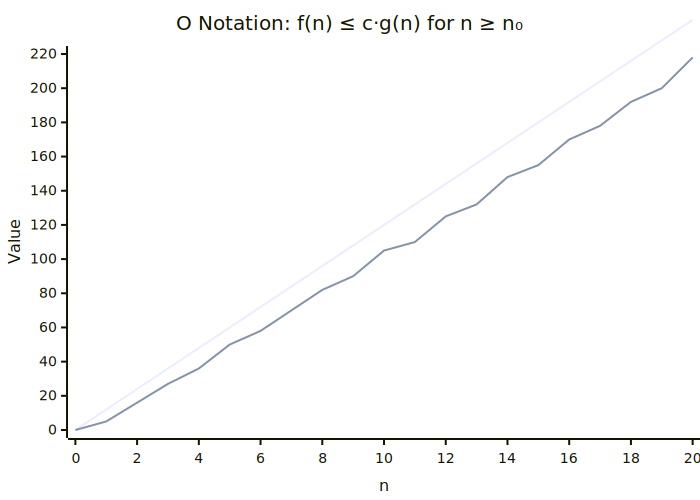
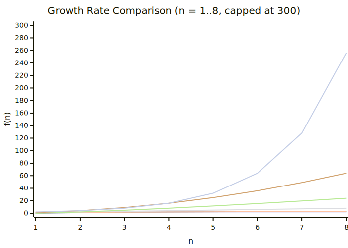
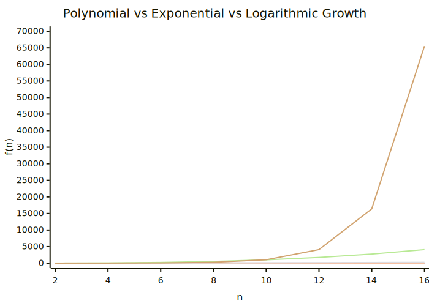

# Growth of Functions（関数の増加度）

---

## 目次

1. なぜ漸近的記法が必要か
2. 実数の大小関係とのアナロジー
3. Θ（シータ）記法 — Tight Bound
4. O（ビッグオー）記法 — 上界
5. Ω（オメガ）記法 — 下界
6. 漸近的記法の性質
7. little-o / little-omega — 厳密な上下界
8. 三分律が成り立たないこと
9. 質疑応答対策 — 刺されやすいポイント
10. まとめ

---

## なぜ漸近的記法が必要か

アルゴリズムの実行時間を **正確な関数** で表すのは難しいし、あまり役に立たない。

- 同じアルゴリズムでも、実装・ハードウェア・入力によって定数係数が変わる
- `3n² + 17n + 5` と `7n² + 2n + 11` は、詳細は違うが **増え方** は同じ
- 大きな n に対しては、**定数係数や低次項は無視してよい**

> 本質的に知りたいのは「n が大きくなったとき、関数はどのくらい速く増えるか」

この「増え方のオーダー」を簡潔に表す道具が **漸近的記法（asymptotic notation）** である。

---

## 実数の大小関係とのアナロジー

漸近的記法は、実数 a, b の大小関係に似ている。

| 実数の比較 | 漸近的比較 | 意味 |
|---|---|---|
| a = b | f = Θ(g) | 同じオーダー（同じ増え方） |
| a ≤ b | f = O(g) | f は g 以下の増え方 |
| a ≥ b | f = Ω(g) | f は g 以上の増え方 |
| a < b | f = o(g) | f は g より **厳密に** 小さい増え方 |
| a > b | f = ω(g) | f は g より **厳密に** 大きい増え方 |

> ただし、重要な違いもある（後述: 三分律が成り立たない）。

---

## Θ 記法の定義

**定義**: f(n) = Θ(g(n)) とは、次を満たす正の定数 c₁, c₂, n₀ が存在すること。

```
∀ n ≥ n₀ :  0 ≤ c₁・g(n) ≤ f(n) ≤ c₂・g(n)
```

言い換えると:

- n が十分大きければ、f(n) は **g(n) の定数倍の範囲内** に収まる
- c₁・g(n) が下の壁、c₂・g(n) が上の壁

**直感**: f と g は「同じ増え方をする」

---

## Θ はなぜ "tight bound" と呼ばれるか

Θ は **上界と下界を同時に与える** から "tight"（きつい）と呼ばれる。

```
c₁・g(n) ≤ f(n) ≤ c₂・g(n)
```

- **上からも** 下からも **挟み込んでいる**
- 「f は高々 g の定数倍」かつ「f は少なくとも g の定数倍」
- これが成立するということは、f と g は **同じオーダー** で増えているということ

> O だけだと「これより遅くない」ことしか言えない。
> Θ は「これより遅くも速くもない」ことを保証する。

---

## O 記法の定義

**定義**: f(n) = O(g(n)) とは、次を満たす正の定数 c, n₀ が存在すること。

```
∀ n ≥ n₀ :  0 ≤ f(n) ≤ c・g(n)
```

**グラフ上の意味**:

- **n₀**: 「この先、もうずっと」という境界線。n₀ 未満では何が起きてもよい
- **c・g(n)**: 上からの壁。c を掛けて f(n) の上に覆いかぶさる直線（または曲線）
- n₀ より右側では、f(n) は c・g(n) を **決して越えない**

**直感**: f は g より **速く増えない**（定数倍の差は許容）

---

## Ω 記法の定義

**定義**: f(n) = Ω(g(n)) とは、次を満たす正の定数 c, n₀ が存在すること。

```
∀ n ≥ n₀ :  0 ≤ c・g(n) ≤ f(n)
```

**直感**: f は g より **遅く増えない**（定数倍の差は許容）

**Θ との関係**:

```
f(n) = Θ(g(n)) ⟺ f(n) = O(g(n)) かつ f(n) = Ω(g(n))
```

> Θ は O と Ω の **共通部分** である。

---

## 定義の図示（O 記法の例）



> 図: images/asymptotic-notation-graph.svg — 上の壁は g(n) そのものではなく **c・g(n)**（定数倍）である点に注意。O 記法では下の壁は示さない（Θ とは異なる）。

```
  c・g(n)
    ＼          ← 上の壁（c = 2 とする）
     ＼
      ＼  f(n)
       ＼↗
        ＼
  ────────|──────→ n
         n₀
```

- n₀ より右では、f(n) は常に c・g(n) 以下
- n₀ より左では、f(n) が c・g(n) を上回っていてもよい
- **c は n に依存しない定数** である（ここが重要）

---

## O(g) を集合としてみる

O(g) は **関数の集合** と考えることができる。

```
O(g) = { f | ∃c>0, ∃n₀>0, ∀n≥n₀ : 0 ≤ f(n) ≤ c・g(n) }
```

同様に:

```
Ω(g) = { f | ∃c>0, ∃n₀>0, ∀n≥n₀ : 0 ≤ c・g(n) ≤ f(n) }

Θ(g) = O(g) ∩ Ω(g)
```

> **f(n) = O(g(n)) は、厳密には f(n) ∈ O(g(n)) と書くべき**

等号 `=` は記法上の慣習であり、対称性はない:
- `n² = O(n³)` は正しいが、`O(n³) = n²` は意味が変わる

---

## f(n) = O(g(n)) の等号は「所属」である

```
f(n) = O(g(n))    ← 慣習的な書き方
f(n) ∈ O(g(n))    ← 厳密な意味
```

なぜ `=` を使うのか:
- 歴史的な理由（Knutḥ の提案による普及）
- 記法として簡潔だから

しかし **注意**:
- `n² = O(n³)` と `n² = O(n²)` は **両方とも正しい**
- O(n³) ⊃ O(n²) だから、矛盾ではない
- この等号は **代入可能性がない**（通常の等号とは異なる）

---

## asymptotically nonnegative の必要性

漸近的記法の定義では、f と g は **asymptotically nonnegative**（漸近的に非負）であることを仮定する。

**理由**: 定義に `0 ≤ f(n)` や `0 ≤ c・g(n)` が含まれるため。

- 十分大きな n に対して f(n) ≥ 0 でなければならない
- そうでないと「c・g(n) ≤ f(n)」という不等式が無意味になる
- 例: `f(n) = -n` は asymptotically nonnegative ではない → Θ 記法を適用できない

> 実用的には、アルゴリズムの実行時間は非負なので問題にならない。
> しかし **一般の関数に適用する際は確認が必要**。

---

## Θ, O, Ω の具体例

```
3n³ + 2n² + 1 = Θ(n³)    ← 最高次項が支配的
3n³ + 2n² + 1 = O(n³)    ← もちろん O でもある
3n³ + 2n² + 1 = O(n⁴)    ← n⁴ でも上界として成立
3n³ + 2n² + 1 = Ω(n³)    ← 下界としても成立
3n³ + 2n² + 1 = Ω(n²)    ← n² でも下界として成立
3n³ + 2n² + 1 ≠ Ω(n⁴)   ← n⁴ の定数倍には届かない
```

**注意**:
- `3n³ = O(n³)` は **tight** な上界（= Θ でもある）
- `3n³ = O(n⁴)` は正しいが **loose** な上界
- O は **最悪計算量そのものではない**（単なる上界である）

---

## O は「最悪計算量そのもの」ではない

よくある誤解と正しい理解:

| ❌ 誤解 | ✅ 正しい理解 |
|---|---|
| O は最悪ケースのことだ | O は関数の **上界** を表す記法にすぎない |
| 最悪ケースは常に O で表す | 最悪ケースは Θ で表してもよい |
| O(n²) は「最悪で n²」の意味 | O(n²) は「n² の定数倍以下に抑えられる」の意味 |

**ポイント**:
- O 記法は **任意の関数の上界** を表す汎用的な記法
- 最悪ケース解析で使われることが多いが、**O = 最悪** ではない
- 同様に、Ω = 最善 でもない

---

## 漸近的記法の基本性質（1/2）

**推移性**:
- f = O(g) かつ g = O(h) ⟹ f = O(h)
- 同様に Θ, Ω でも成り立つ

**反射性**:
- f = O(f), f = Ω(f), f = Θ(f)
- 任意の（asymptotically nonnegative な）関数は自分自身の上界かつ下界

**対称性**:
- f = Θ(g) ⟺ g = Θ(f)

---

## 漸近的記法の基本性質（2/2）

**転置対称性**:
- f = O(g) ⟺ g = Ω(f)
- f = o(g) ⟺ g = ω(f)

> Θ だけが対称で、O と Ω は **互いにひっくり返った関係**。

O は等号ではないので、**推移性は成り立つが、反対称性は成り立たない**:

- f = O(g) かつ g = O(f) ⟹ f = Θ(g)
- これは「≤ と ≥ が両方成り立てば =」と同じ論理構造

---

## 漸近的記法を含む式の読み方

O や Θ を含む等式は、**右辺の集合に左辺が属する** と読む。

```
2n² + 3n = Θ(n²)      → 2n²+3n は Θ(n²) に属する
n² = O(n²)             → n² は O(n²) に属する
2n² = O(n³)            → 2n² は O(n³) に属する
```

**式の中に O が含まれる場合**:

```
2n² + 3n + 1 = 2n² + Θ(n)
```

これは「3n + 1 を Θ(n) の集合から選んだある関数に置き換えてもよい」という意味。
右辺全体が **一つの集合** を表し、左辺がその集合に属する。

---

## little-o 記法の定義

**定義**: f(n) = o(g(n)) とは、**任意の** 正の定数 c > 0 に対して、次を満たす n₀ > 0 が存在すること。

```
∀ c > 0, ∃ n₀ > 0, ∀ n ≥ n₀ : 0 ≤ f(n) < c・g(n)
```

big-O との違い:
- big-O: **ある c** が存在する（∃c）
- little-o: **任意の c** について成り立つ（∀c）

**直感**: f は g に比べて **取るに足らないほど小さい**

> little-o は「どれだけ小さな c を選んでも、いつかは c・g(n) より下になる」

---

## little-omega 記法の定義

**定義**: f(n) = ω(g(n)) とは、**任意の** 正の定数 c > 0 に対して、次を満たす n₀ > 0 が存在すること。

```
∀ c > 0, ∃ n₀ > 0, ∀ n ≥ n₀ : 0 ≤ c・g(n) < f(n)
```

big-Ω との違い:
- big-Ω: **ある c** が存在する（∃c）
- little-ω: **任意の c** について成り立つ（∀c）

**直感**: f は g に比べて **圧倒的に大きい**

**関係**:
```
f = o(g)  ⟺  g = ω(f)
```

---

## little-o / little-omega の「for any c」の強さ

「∀ c > 0」という条件がどれだけ強いか:

```
n² = o(n³) について考えてみる:

c = 100 でも: n ≥ 101 のとき n² < 100・n³ （n² < 100n³ ↔ 1 < 100n）
c = 0.001 でも: n ≥ 1001 のとき n² < 0.001・n³ （1 < 0.001・n）
c = 10⁻¹⁰ でも: n が十分大きければ必ず成立
```

**極限による特徴づけ**（asymptotically nonnegative な関数）:

```
f(n) = o(g(n))  ⟺  lim_{n→∞} f(n)/g(n) = 0

f(n) = ω(g(n))  ⟺  lim_{n→∞} f(n)/g(n) = ∞
```

> little-o は「比が 0 に潰れる」、little-ω は「比が ∞ に発散する」

---

## Θ, O, Ω, o, ω の関係まとめ



> 図: images/asymptotic-notation-venn.svg — 厳密なベン図ではなく包含関係の概念を示した図。

```
                f と g の関係
                    |
        ┌───────────┼───────────┐
        |           |           |
    f = o(g)    f = Θ(g)    f = ω(g)
    「f << g」   「f ≈ g」    「f >> g」
        |           |           |
        └─────┬─────┘───────────┘
              |           |
          f = O(g)    f = Ω(g)
          「f ≤ g」    「f ≥ g」
```

**包含関係**:

```
o(g) ⊂ O(g)      （厳密に小さい ⟹ 上界でもある）
ω(g) ⊂ Ω(g)      （厳密に大きい ⟹ 下界でもある）
Θ(g) ⊂ O(g)      （同オーダー ⟹ 上界でもある）
Θ(g) ⊂ Ω(g)      （同オーダー ⟹ 下界でもある）
```

---

## 具体例で確認

| 関数のペア | o? | O? | Θ? | Ω? | ω? |
|---|---|---|---|---|---|
| n² と n³ | ✅ | ✅ | ❌ | ❌ | ❌ |
| n² と n² | ❌ | ✅ | ✅ | ✅ | ❌ |
| n³ と n² | ❌ | ❌ | ❌ | ✅ | ✅ |
| n² と n²/2 | ❌ | ✅ | ✅ | ✅ | ❌ |
| n¹⁰⁰ と 2ⁿ | ✅ | ✅ | ❌ | ❌ | ❌ |

最後の例に注意: **n¹⁰⁰ = o(2ⁿ)**。n が十分大きければ、どんな多項式も指数関数に負ける。

---

## 三分律（Trichotomy）が成り立たない

実数には **三分律** が成り立つ:

```
任意の a, b に対して、a < b, a = b, a > b のいずれかちょうど一つが成り立つ
```

しかし、**関数の漸近的比較では三分律は成り立たない**。

あるペア f, g は:
- f = O(g) でも f = Ω(g) でもない
- f = o(g) でも f = ω(g) でも f = Θ(g) でもない

つまり **比較不可能な** 関数ペアが存在する。

---

## 比較不可能な例

**例**: f(n) と g(n) を次のように定義する。

```
f(n) = n             （すべての n について）
g(n) = n^(1 + sin(n))
```

- sin(n) は -1 から 1 の間を振動する
- g(n) は n⁰ = 1 と n² の間を永遠に振動する
- n₀ をどこにとっても、その先で g(n) が f(n) より大きくなることも小さくなることもある

したがって:
- f(n) = O(g(n)) ではない（g(n) が f(n) より小さくなりうる）
- f(n) = Ω(g(n)) ではない（g(n) が f(n) より大きくなりうる）

> どちらの不等式も **ずっと** 成り立つことができない。

---

## 比較不可能な例の図的イメージ

```
  g(n) = n^(1+sin(n))
    ／＼    ／＼      ← n² 付近まで跳ね上がる
   /  ＼＼/   ＼
  /    ／＼    ＼      ← n⁰ = 1 付近まで落ちる
 /    /   ＼    ＼
──────── f(n) = n ────→
```

- g(n) は f(n) = n を何度も上下に交差する
- どの n₀ を選んでも、n₀ より先で g(n) < f(n) となる n が存在する
- 同時に g(n) > f(n) となる n も存在する
- 定数 c を選んでもこの振動は消えない

---

## よくある比較の階層

典型的な関数クラスの増加順（小 → 大）:



> 図: images/growth-rate-comparison.svg — 有限範囲 n = 1..8 の値比較。n³ は n = 7 で 343 に達するため図から省略。真の漸近的関係は O(1) ⊂ O(log n) ⊂ ... ⊂ O(n³) ⊂ O(2ⁿ) を参照のこと。

特に「多項式 vs 指数」の差は漸近解析で最も強調すべき点の一つである。下図は nᵏ と 2ⁿ の交差を拡大したもので、多項式がどのくらい急激に指数に追い越されるかを補強する。



> 図: images/polynomial-exponential-comparison.svg — nᵏ（多項式）と 2ⁿ（指数）の増加を比較。n が大きくなると指数が多項式を圧倒することを視覚的に確認できる。C3-02 の全体像を補強する図。

```
O(1) ⊂ O(log n) ⊂ O(√n) ⊂ O(n) ⊂ O(n log n) ⊂ O(n²) ⊂ O(n³) ⊂ O(2ⁿ) ⊂ O(n!)
```

これらは **すべて strict な包含** である:

```
log n = o(√n),   √n = o(n),   n = o(n log n)? 
```

注意: `n` と `n log n` の関係は、`n = o(n log n)` であり、Θ ではない。

---

## スライドの多項式の例の確認

```
3n³ + 2n² + n + 7 = Θ(n³)
```

**証明のスケッチ**:
- n ≥ 1 のとき: `3n³ ≤ 3n³ + 2n² + n + 7 ≤ 3n³ + 2n³ + n³ + 7n³ = 13n³`
- したがって c₁ = 3, c₂ = 13, n₀ = 1 で定義を満たす

**n₀ の役割**:
- n₀ = 1 で十分なこともあるが、もっと大きな n₀ が必要なこともある
- 例: `n² / 100 - 100n = Θ(n²)` なら n₀ を十分大きくとる必要がある
- **c と n₀ は n に依存しない定数** であることが重要

---

## 漸近的記法と極限の関係

f, g を asymptotically nonnegative とする。

```
lim_{n→∞} f(n)/g(n) = L が存在するとして:

L = 0     →  f = o(g)
0 < L < ∞ →  f = Θ(g)
L = ∞     →  f = ω(g)
```

> 極限が **存在しない** 場合（振動する場合）、この判定は使えない。
> 先述の「比較不可能な例」がまさにこのケース。

**注意**: 極限が存在しなくても O や Ω が成り立つことはある。
また、極限が存在しないからといって Θ が成り立たないとは限らない
（例: f(n) = n(2 + sin n) と g(n) = n は Θ 同値だが比の極限は存在しない）。
Θ の否定を示すには、定義に立ち返って c₁・g(n) ≤ f(n) ≤ c₂・g(n) を満たす定数が
存在しないことを示す。

---

## 実用的なルールのまとめ

多項式では、**最高次項だけ** に注目すればよい:

```
aₖnᵏ + aₖ₋₁nᵏ⁻¹ + ... + a₁n + a₀ = Θ(nᵏ)    (aₖ > 0)
```

| ルール | 内容 |
|---|---|
| 低次項は無視 | Θ(n³ + n) = Θ(n³) |
| 定数係数は無視 | Θ(5n²) = Θ(n²) |
| 指数 > 多項式 | n¹⁰⁰ = o(2ⁿ) |
| 多項式 > 対数 | log n = o(n^ε) for any ε > 0 |
| log の底は無視 | Θ(log₂ n) = Θ(log₁₀ n) = Θ(ln n) |

---

## Θ を「完全に同じ関数」と言わない

Θ(g) は **g と同じ増え方をする関数の集合** であり、「g と完全に同じ」ではない。

- `3n² + n` と `n²` は **Θ の意味で同オーダー** だが、**同じ関数ではない**
- 定数倍の違い、低次項の違いは Θ の中に吸収される
- Θ は **同値類** を与える（同じクラスに属する関数は「同じオーダー」）

```
Θ(n²) という集合には:
  n², 3n², n² + n, 5n² + 100, 0.001n², ...
がすべて含まれる
```

> 「f = Θ(g)」は「f と g は同じ増え方のクラスに属する」という意味。

---

## O 記法の正しい使い方・間違った使い方

| ✅ 正しい | ❌ 間違い・不適切 |
|---|---|
| 「このアルゴリズムの実行時間は O(n log n) である」 | 「最悪計算量は O(n²) だ」（Θ(n²) が正しい情報量） |
| 「3n² = O(n³) は正しい」 | 「O(n³) = 3n²」と逆に書く（集合として意味が変わる） |
| 「この上限は O(n log n) で抑えられる」 | 「O(n log n) は最悪ケースだ」（最善ケースでも O 記法は使える） |

**基本姿勢**:
- O は「〜以下に抑えられる」という **上界の主張**
- 計算量を正確に伝えたいときは **Θ** を使う
- O を使うなら「何についての上界か」を明確にする

---

## 質疑応答対策 — 刺されやすいポイント（1/3）

**Q: 「O(n²) のアルゴリズム」と言ったとき、それは最悪ケースのことですか？**

A: 必ずしもそうではない。O(n²) は単なる上界であり:
- 最悪ケースが Θ(n²) で、平均が Θ(n log n) のアルゴリズムでも
- 全ケースで O(n²) と書ける（正確には O(n³) でも O(2ⁿ) でも正しい）
- 議論の対象（最悪・平均・下界）を **明示** すべき

---

## 質疑応答対策 — 刺されやすいポイント（2/3）

**Q: f(n) = O(g(n)) の等号は本当の等号ですか？**

A: 違う。厳密には **f(n) ∈ O(g(n))** である。
- O(g) は関数の集合
- `=` は慣習的な記法
- `n² = O(n³)` は正しいが `O(n³) = n²` は通常の等号のように振る舞わない
- 連鎖的な記法 `n = O(n²) = O(n³)` は右向きにのみ意味を持つ

**Q: c は n に依存してよいですか？**

A: いいえ。c は **n に依存しない定数** でなければならない。
- もし c が n に依存すると、任意の関数が O(1) になってしまう
- n₀ も n に依存しない（ただし定数 c には依存してよい ← big-O の定義上）
- little-o の n₀ は c に依存してよい（∀c に対して別々の n₀ を選べる）

---

## 質疑応答対策 — 刺されやすいポイント（3/3）

**Q: すべての関数ペアは漸近的に比較可能ですか？**

A: いいえ。三分律は成り立たない。
- f(n) = n と g(n) = n^(1+sin(n)) は比較不可能
- 振動する関数は O にも Ω にも属さない相手がありうる

**Q: Θ(n log n) と Θ(n) はどう違いますか？**

A: log n は n よりも **厳密に** 小さい増加速度を持つ。
- log n = o(n) だから、n log n と n は Θ の意味で異なる
- n log n / n = log n → ∞ なので n log n ≠ Θ(n)
- しかし n log n = O(n²) である（n log n / n² = (log n)/n → 0）

---

## c と n₀ に依存関係を許さない理由

もし c が n に依存してよいとすると:

```
f(n) = n² を O(1) にしたい
→ c(n) = n² とすれば ∀n ≥ 1 : f(n) = n² ≤ n²・1
→ すべての関数が O(1) になってしまう！
```

これでは記法として意味がない。

**正しい制約**:
- big-O: ∃c>0, ∃n₀ : ∀n ≥ n₀ → c は **先に選ぶ**（n とは無関係）
- little-o: ∀c>0, ∃n₀ : ∀n ≥ n₀ → n₀ は c ごとに選んでよいが、c は n とは無関係

> 「定数」の意味を崩すと、漸近的記法の体系が壊れる。

---

## まとめ（1/2）

### 五つの漸近的記法

| 記法 | 意味 | 定数の条件 |
|---|---|---|
| Θ(g) | f と g は同じ増え方 | ∃c₁, c₂, n₀ |
| O(g) | f は g 以下の増え方 | ∃c, n₀ |
| Ω(g) | f は g 以上の増え方 | ∃c, n₀ |
| o(g) | f は g より厳密に小さい | ∀c, ∃n₀ |
| ω(g) | f は g より厳密に大きい | ∀c, ∃n₀ |

### 核心的注意点
- O は上界であり、**最悪計算量そのものではない**
- Θ は同オーダーであり、**完全に同じ関数ではない**
- c と n₀ は **n に依存しない定数**
- 三分律は成り立たない（比較不可能なペアが存在する）

---

## まとめ（2/2）

### 漸近的記法を使う理由
- アルゴリズムの本質的な性能を、実装・環境に依存せず議論できる
- 定数係数や低次項を無視して、増加の傾向に注目できる

### 記法の読み方
- `f(n) = O(g(n))` は `f(n) ∈ O(g(n))` の慣習的書き方
- O(g), Ω(g), Θ(g) は **関数の集合**

### 次回への接続
- 第4章では、この記法を使って分割統治法の漸化式を解析する
- マスター定理の証明にも Θ, O, Ω が不可欠

---

## 参考資料

- CLRS『Introduction to Algorithms』第3章: Growth of Functions
- CLRS §3.1: Asymptotic notation
- CLRS §3.2: Standard notations and common functions
- Knuth, D. "Big Omicron and Big Omega and Big Theta", SIGACT News, 1976
