# Merge Sort と分割統治法

---

## 目次

1. ソート問題と動機づけ
2. 分割統治法とは
3. Merge Sort のアルゴリズム
4. 計算量解析
5. 一般的な分割統治法への拡張
6. まとめ

---

## ソート問題のおさらい

- **入力**: n 個の要素からなる配列
- **出力**: 要素が昇順（または降順）に並んだ配列
- 身近で基本的な問題だが、効率的な解法には工夫が必要

> すでに Insertion Sort（O(n²)）や Selection Sort（O(n²)）を学んだ。
> これより速くできるか？

---

## 既存アルゴリズムの限界

| アルゴリズム | 最良 | 平均 | 最悪 |
|---|---|---|---|
| Insertion Sort | Θ(n) | Θ(n²) | Θ(n²) |
| Selection Sort | Θ(n²) | Θ(n²) | Θ(n²) |

- 比較ベースのソートの理論的下界は **Θ(n log n)**
- O(n²) アルゴリズムでは大規模データに対応できない
- より良いアプローチが必要 → **分割統治法**

---

## 分割統治法（Divide and Conquer）とは

大きな問題を小さな問題に分割し、それぞれを独立に解き、結果を統合する手法。

**3 つのステップ**:

1. **Divide（分割）**: 問題を複数の部分問題に分ける
2. **Conquer（征服）**: 部分問題を再帰的に解く
3. **Combine（統合）**: 部分問題の解を合わせて全体の解を得る

---

## 分割統治法のイメージ



> 図: images/divide-and-conquer-paradigm.svg

<details>
<summary>別の簡略例を ASCII で見る</summary>

```
          問題（サイズ n）
         /              \
   部分問題A          部分問題B
   （サイズ n/2）    （サイズ n/2）
      /    \            /    \
    ...    ...        ...    ...
```

</details>

- 各部分問題は元の問題と **同じ構造** を持つ
- 十分小さくなったら直接解く（基底条件）
- 再帰の考え方が中心的

---

## Merge Sort の概要

Merge Sort は分割統治法の代表的な適用例。

1. **Divide**: 配列を中央で前半と後半に分割
2. **Conquer**: 前半・後半をそれぞれ再帰的にソート
3. **Combine**: ソート済みの 2 つの配列を **merge（併合）** する

> キーとなる操作は **merge** である。

---

## Merge Sort の具体例（全体像）

入力: `[8, 7, 9, 10, 5, 12, 2, 3]`



> 図: images/divide-and-conquer-tree.svg

<details>
<summary>ASCII アート版（テキスト表現）</summary>

```
分割        [8,7,9,10,5,12,2,3]
              /              \
      [8,7,9,10]          [5,12,2,3]
       /      \             /      \
    [8,7]   [9,10]      [5,12]   [2,3]
    / \      / \         / \      / \
  [8] [7] [9] [10]   [5] [12] [2] [3]

統合        ← merge しながら戻る →
```

</details>

---

## 分割フェーズの詳細（1/3）— レベル 0 → 1



> 図: images/divide-step1.svg

<details>
<summary>ASCII アート版（テキスト表現）</summary>

```
[8,7,9,10,5,12,2,3]     ← レベル 0（サイズ 8）
       ↙         ↘
[8,7,9,10]    [5,12,2,3] ← レベル 1（サイズ 4）
```

</details>

- 配列を **中央** で 2 等分する
- 各部分に対して再帰的に同じ操作を繰り返す

---

## 分割フェーズの詳細（2/3）— レベル 1 → 2



> 図: images/divide-step2.svg

<details>
<summary>ASCII アート版（テキスト表現）</summary>

```
[8,7,9,10]    [5,12,2,3] ← レベル 1（サイズ 4）
    ↙    ↘       ↙    ↘
 [8,7] [9,10] [5,12] [2,3] ← レベル 2（サイズ 2）
```

</details>

- 各部分をさらに **中央** で 2 等分する

---

## 分割フェーズの詳細（3/3）— レベル 2 → 3



> 図: images/divide-step3.svg

<details>
<summary>ASCII アート版（テキスト表現）</summary>

```
 [8,7] [9,10] [5,12] [2,3] ← レベル 2（サイズ 2）
  ↙ ↘   ↙ ↘   ↙ ↘   ↙ ↘
 [8][7] [9][10] [5][12] [2][3] ← レベル 3（サイズ 1）
```

</details>

- サイズ 1 に到達 → **基底条件** で再帰停止
- 分割の深さは **log₂ n** レベル

---

## 基底条件（Base Case）

**いつ再帰を止めるか？**

- 配列のサイズが **1** のとき、その配列はすでにソート済み
- これ以上分割する必要はない
- そのまま結果として返す

```
mergeSort([5]) → [5]   // ソート済み、そのまま返す
```

> 基底条件の設計は分割統治法において不可欠。
> これを間違えると無限再帰に陥る。

---

## Merge（併合）の考え方

2 つの **ソート済み配列** を 1 つのソート済み配列に統合する操作。

- 両方の配列の **先頭要素** を比較
- 小さい方を結果に追加し、その配列のポインタを進める
- どちらかが空になったら、残りをそのまま追加

**重要な性質**: 各反復で 1 回比較し、少なくとも 1 要素が結果に確定する → 全体で線形時間に収まる

---

## Merge の詳細トレース（1/3）



> 図: images/merge-procedure-steps.svg - CLRS Figure 2.3 に対応する番兵付き `MERGE` の詳細トレース。

この図では、補助配列 `L` と `R` に番兵 `INF` を追加して、
比較ループの中で「どちらかが空か」を毎回判定しなくてよい形を示している。

<details>
<summary>ASCII アート版（テキスト表現）</summary>

```
結果: []
左: [7, 8]    右: [9, 10]

Step 1: 7 < 9 → 7 を追加
結果: [7]
左: [8]       右: [9, 10]
```

</details>

---

## Merge の簡略例（2/3）

```
Step 2: 8 < 9 → 8 を追加
結果: [7, 8]
左: []        右: [9, 10]

Step 3: 左が空 → 残りを追加
結果: [7, 8, 9, 10]
```

図の詳細トレースとは別に、最小の例で見ると 2 つのソート済み配列 `[7, 8]` と `[9, 10]` は
`[7, 8, 9, 10]` に併合された。

---

## Merge の簡略例（3/3）

次のレベルの merge:

```
左: [5, 12]   右: [2, 3]

Step 1: 5 > 2 → 2 を追加
Step 2: 5 > 3 → 3 を追加
Step 3: 5 < 12 → 5 を追加（右は空なので左の残りを追加）
結果: [2, 3, 5, 12]
```

最終的な統合:

```
[7, 8, 9, 10] と [2, 3, 5, 12] を merge
→ [2, 3, 5, 7, 8, 9, 10, 12]  ✅
```

---

## Merge Sort 擬似コード — mergeSort

```
function mergeSort(A, left, right):
    if right - left <= 1:
        return   // 基底条件: サイズ1以下

    mid = (left + right) / 2
    mergeSort(A, left, mid)    // 前半をソート
    mergeSort(A, mid, right)   // 後半をソート
    merge(A, left, mid, right) // 併合
```

- `A`: ソート対象の配列
- `left`, `right`: 処理対象の区間 [left, right)
- インプレースで動作する実装例

---

## Merge Sort 擬似コード — merge

```
function merge(A, left, mid, right):
    L = A[left..mid) のコピー
    R = A[mid..right) のコピー
    i = 0, j = 0, k = left

    while i < |L| and j < |R|:
        if L[i] <= R[j]:
            A[k] = L[i];  i++
        else:
            A[k] = R[j];  j++
        k++

    // 残りの要素をコピー
    while i < |L|:  A[k] = L[i]; i++; k++
    while j < |R|:  A[k] = R[j]; j++; k++
```

> ここでは番兵を使わない実装で書いている。考え方自体は図の番兵付き版と同じで、先頭同士を比べて小さい方を順に確定していく。

---

## 計算量解析への導入

Merge Sort の実行時間を定式化しよう。

- **Divide**: 配列を中央で分割 → **Θ(1)**
- **Conquer**: 2 つの部分問題（サイズ n/2）を再帰的に解く
- **Combine**: merge → **Θ(n)**

これを漸化式で表す。

---

## 漸化式の導出

Merge Sort の実行時間 T(n) は次のように表される：

```
T(n) = 2・T(n/2) + Θ(n)
```

- `2・T(n/2)`: 2 つのサイズ n/2 の部分問題を再帰的に解く時間
- `Θ(n)`: merge にかかる時間
- `T(1) = Θ(1)`: 基底条件

> この形の漸化式は、マスター定理のケース 2 に該当する。

---

## 再帰木による解析（1/4）— ルート

```
                 T(n)                コスト: n
              /        \
         T(n/2)      T(n/2)
```

- ルートノードの仕事量（merge のコスト）は **n**
- 2 つの子ノードそれぞれがサイズ n/2 の問題を処理

---

## 再帰木による解析（2/4）— レベルごと



> 図: images/merge-sort-recursion-tree-analysis.svg

<details>
<summary>ASCII アート版（テキスト表現）</summary>

```
Level 0:          n                  = n
Level 1:    n/2    n/2               = n
Level 2:  n/4 n/4  n/4 n/4          = n
  ...
Level k:  n/2^k が 2^k 個           = n
```

</details>

**各レベルの合計コストは常に n**

- レベル k には 2^k 個のノード
- 各ノードのコストは n / 2^k
- 合計: 2^k × (n / 2^k) = **n**

---

## 再帰木による解析（3/4）— 葉

- 葉に到達するのは **サイズが 1** になったとき
- 深さ: log₂ n レベル（レベル 0 〜 log₂ n - 1）
- 葉の数: **n 個**
- 各葉の仕事量: Θ(1)
- 葉のレベルの合計: **n × Θ(1) = Θ(n)**

---

## 再帰木による解析（4/4）— 総和

```
T(n) = (Level 0) + (Level 1) + ... + (Level log n - 1) + 葉
     =    n      +    n      + ... +        n           + Θ(n)
     =  n × log₂ n  +  Θ(n)
     =  Θ(n log n)
```

| 項 | 値 |
|---|---|
| レベル数 | log₂ n |
| 各レベルのコスト | n |
| 総コスト | **Θ(n log n)** |

---

## Θ(n log n) の直感的理解

- n 個の要素を扱う仕事が、log n 段階繰り返される
- 分割により問題サイズは半減するが、merge で全体をなめる
- 「全体をなめる」コスト Θ(n) が log n 回積み重なる

```
n × log n ≒「データ全体を何回もスキャンする」
```

---

## Best / Average / Worst Case

| ケース | 計算量 | 理由 |
|---|---|---|
| Best | Θ(n log n) | merge の比較回数は ⌈n/2⌉ 〜 n-1 で Θ(n) |
| Average | Θ(n log n) | 分割構造が常に同じ |
| Worst | Θ(n log n) | 同上 |

> **Merge Sort はすべてのケースで Θ(n log n)**

---

## なぜ常に Θ(n log n) なのか

ポイント: **Merge Sort の動作は入力の順序に依存しない**

- 分割は常に中央で行う → 再帰の木の形は常に同じ
- merge の比較回数は最大でも n-1 回、最小でも ⌈n/2⌉ 回
- いずれにしても **Θ(n)**

したがって:

```
T(n) = 2・T(n/2) + Θ(n)   ← 定数 c の値が多少変わるだけ
```

c の定数倍の違いは Θ 記法の中に吸収される。

---

## 空間計算量

Merge Sort は **追加のメモリ** を必要とする。

| 要素 | コスト |
|---|---|
| 作業用配列 L, R | O(n) |
| 再帰のスタック | O(log n) |

**空間計算量: Θ(n)**

- merge のたびに一時配列を確保するため
- これは Merge Sort の **欠点** の一つ
- In-place ソート（Heap Sort など）と比較するとメモリ消費が大きい

---

## 他のソートアルゴリズムとの比較

| アルゴリズム | 時間（最良） | 時間（平均） | 時間（最悪） | 空間 | 安定 |
|---|---|---|---|---|---|
| Insertion Sort | Θ(n) | Θ(n²) | Θ(n²) | O(1) | ✅ |
| Merge Sort | Θ(n log n) | Θ(n log n) | Θ(n log n) | Θ(n) | ✅ |
| Quick Sort | Θ(n log n) | Θ(n log n) | Θ(n²) | O(log n) | ❌ |
| Heap Sort | Θ(n log n) | Θ(n log n) | Θ(n log n) | O(1) | ❌ |

- **安定ソート** であり、最悪ケースでも Θ(n log n) という点が Merge Sort の強み

---

## 一般的な分割統治法（1/2）

Merge Sort で学んだパターンは、多くの問題に適用できる。

```
T(n) = a・T(n/b) + f(n)
```

- **a**: 部分問題の個数
- **n/b**: 各部分問題のサイズ
- **f(n)**: 分割と統合のコスト

この漸化式を解くことで、アルゴリズムの計算量がわかる。

---

## 一般的な分割統治法（2/2）

代表的な適用例:

| アルゴリズム | a | b | f(n) | 計算量 |
|---|---|---|---|---|
| Merge Sort | 2 | 2 | Θ(n) | Θ(n log n) |
| Binary Search | 1 | 2 | Θ(1) | Θ(log n) |
| Quick Sort | 2 | — | Θ(n) | Θ(n log n) avg |
| Strassen（行列積） | 7 | 2 | Θ(n²) | Θ(n^2.81) |

> a, b, f(n) のバランスが計算量を決定する。

---

## マスター定理（Master Theorem）

漸化式 `T(n) = a・T(n/b) + f(n)` を解くための強力なツール。

- **Case 1**: f(n) が n^(log_b a) より小さい → T(n) = Θ(n^(log_b a))
- **Case 2**: f(n) が n^(log_b a) と同程度 → T(n) = Θ(n^(log_b a) × log n)
- **Case 3**: f(n) が n^(log_b a) より大きい → T(n) = Θ(f(n))

**Merge Sort の場合**:
- a = 2, b = 2 → log₂ 2 = 1 → n^1 = n
- f(n) = Θ(n) → Case 2 → **Θ(n log n)** ✅

---

## 分割統治法を適用する際のポイント

1. **部分問題は独立しているか？**
   - 独立でないと単純な分割が難しい（動的計画法の対象になることも）

2. **統合コストは抑えられているか？**
   - 統合に O(n²) かかると全体も O(n²) になり得る

3. **基底条件は正しいか？**
   - サイズ 0 や 1 の処理を確実に定義する

4. **再帰の深さに注意**
   - 深すぎるとスタックオーバーフローの危険

---

## 分割統治法の設計チェックリスト

```
□ 大問題を同等の小問題に分割できるか
□ 小問題の解から大問題の解を構成できるか
□ 基底条件を明確に定義したか
□ 分割・統合のコストを評価したか
□ 計算量の漸化式を立てたか
□ 漸化式を解いてΘを確認したか
```

---

## Merge Sort の長所と短所

### 長所
- 最悪ケースでも **Θ(n log n)** → 安定した性能
- **安定ソート**（等しい要素の順序を保存）
- 連結リストでも効率的に実装可能

### 短所
- **Θ(n) の追加メモリ** が必要
- 定数倍がやや大きい（小規模データでは Insertion Sort の方が速いことも）
- 再帰呼び出しのオーバーヘッド

---

## 実用上の工夫

- **Hybrid Merge Sort**: 小さい部分問題には Insertion Sort を使う
  - 一般に n ≤ 16 程度で切り替えると実用的に高速
- **Bottom-up Merge Sort**: 再帰を使わず反復で実装
  - スタックオーバーフローを回避
- **In-place Merge Sort**: 追加メモリを削減する変種
  - 実装が複雑で定数倍が悪化することも

---

## まとめ（1/2）

### Merge Sort
- 分割統治法に基づくソートアルゴリズム
- 常に **Θ(n log n)** の時間計算量
- 安定ソートだが **Θ(n)** の追加空間が必要

### 分割統治法の 3 ステップ
1. **Divide**: 問題を部分問題に分割
2. **Conquer**: 再帰的に部分問題を解く
3. **Combine**: 結果を統合

---

## まとめ（2/2）

### 計算量解析の流れ
1. 漸化式を立てる: `T(n) = a・T(n/b) + f(n)`
2. 再帰木で可視化する
3. マスター定理で解く

### 本講の学び
- 分割統治法は **再帰的な構造** を持つ問題に強力
- 計算量は **漸化式** で定式化し、体系的に解析する
- アルゴリズム選択では時間計算量だけでなく **空間計算量・安定性** も考慮する

---

## 参考資料

- CLRS『Introduction to Algorithms』第 4 章: Divide-and-Conquer
- Sedgewick & Wayne『Algorithms』第 2 章: Sorting
- 再帰木解析: CLRS §4.4
- マスター定理: CLRS §4.5
